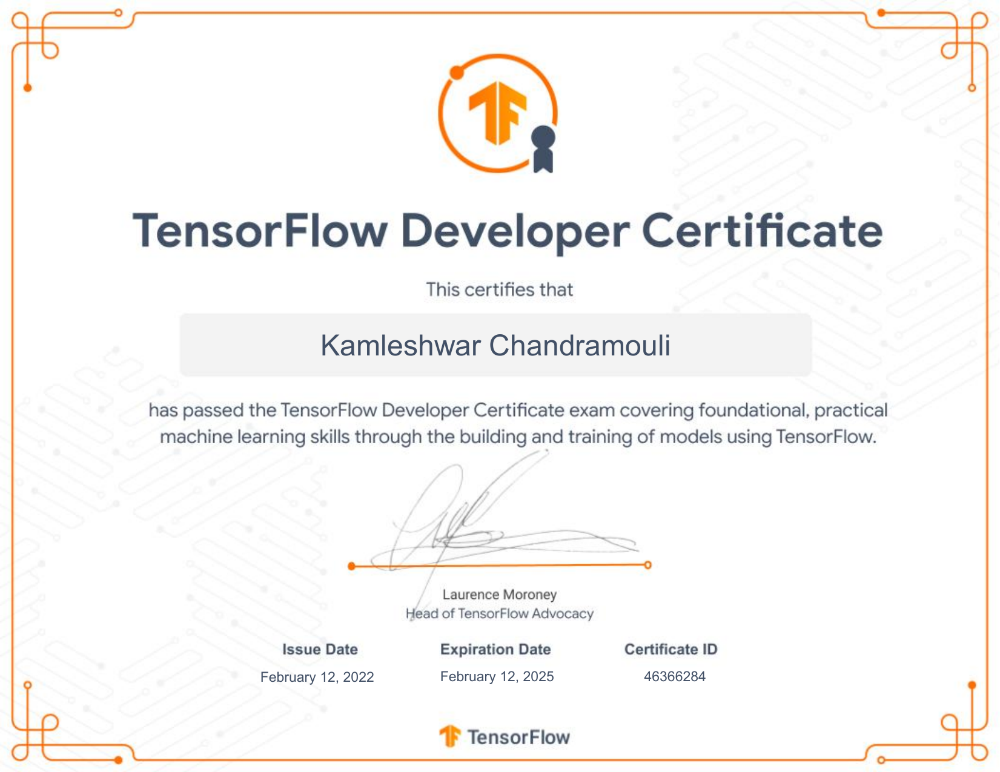
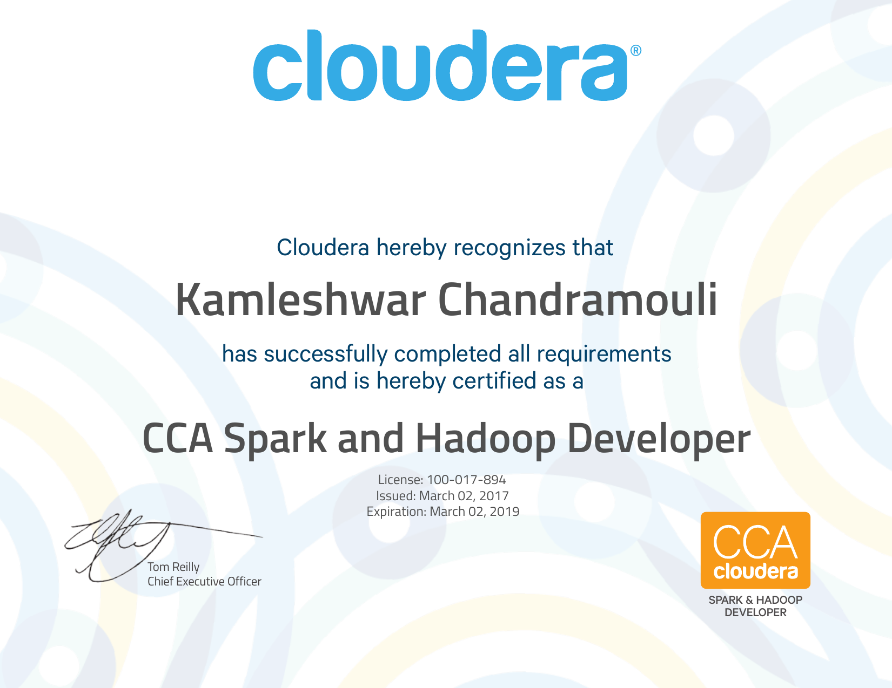

## Hi there, I'm Kamleshwar 

### I'm a Big Data Developer and Machine Learning enthusiast

- 🔭 I’m currently working as Big Data Developer
- 🌱 I’m currently learning Machine Learning
- 👯 I’m looking to collaborate on Machine Learning and Big Data
- 🤔 I’m looking for help with Machine Learning
- 💬 Ask me about the Universe
- 📫 How to reach me: Please check out [Connect with me][contact_me]
- 😄 Pronouns: Kamleshwar
- ⚡ Fun fact: Sometime ponder upon 42 (The answer to life, the universe and everything)

---

### Connect with me:

 

---

### Languages:

 

---

### Frameworks and Tools:

 

---

### IDEs and Notebooks:

 

---

### Certifications:

- **TensorFlow Certification:**

To View/Download TensorFlow Certificate on **credential.net**, click here ❯❯ [TensorFlow Certificate Link](https://www.credential.net/2623664f-40db-49bb-958e-675a043d8a89)

- **CCA Spark and Hadoop Developer(CCA175)**

[contact_me]: https://github.com/imkamleshwar/imkamleshwar/edit/main/README.md#connect-with-me

<!--
**imkamleshwar/imkamleshwar** is a ✨ _special_ ✨ repository because its `README.md` (this file) appears on your GitHub profile.

Here are some ideas to get you started:

- 🔭 I’m currently working on ...
- 🌱 I’m currently learning ...
- 👯 I’m looking to collaborate on ...
- 🤔 I’m looking for help with ...
- 💬 Ask me about ...
- 📫 How to reach me: ...
- 😄 Pronouns: ...
- ⚡ Fun fact: ...
-->
